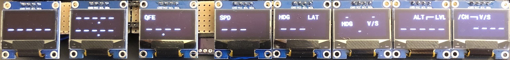

# X Plane 12 Configs and Utils

## XMidiCtrl

Templates for the Behringer X-Touch Mini for [XMidiCtrl](https://github.com/mauer/xmidictrl):

- Citation X
- ToLiss A320

## FCU

A simple [FCU](https://docs.flybywiresim.com/pilots-corner/a32nx/a32nx-briefing/flight-deck/glareshield/fcu/) mockup built on the ESP32 and cheap 0.96" OLED displays using ESPHome for ease of development (Home Assistant not required). Inspired from [Mobiflight-A320-Efis-Fcu-Display-with-ESP32](https://github.com/gagagu/Mobiflight-A320-Efis-Fcu-Display-with-ESP32).

DREFs are subscribed and updated via the UDP protocol. An intermediate python script subscribes to xplane and relays messages to the ESP32 debouncing unchanged DREFs.
